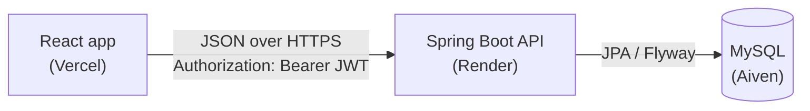

# Food Delivery

A full-stack food delivery app: browse restaurants, fill a cart, log in, place an order, pay (demo), and follow its status. An admin moves orders from Paid to Delivered.

**Live demo:** _added after deployment_
**API docs (Swagger):** _added after deployment_

> The backend runs on Render's free plan, which sleeps when idle. The first request after a break can take about a minute.

### Test logins

| Role     | Email               | Password    |
|----------|---------------------|-------------|
| Customer | `demo@example.com`  | `demo1234`  |
| Admin    | `admin@example.com` | `admin1234` |

## Features

- Restaurant list with search, and a menu page for each restaurant
- Cart that survives a page reload (one restaurant per order)
- Register and log in with JWT; protected pages redirect to login
- Place an order: the server looks up every price and calculates the total
- Demo payment: choose UPI or Card, and the order becomes Paid (no real money moves)
- My orders: every order of the logged-in user, newest first
- Admin page: see all orders and change their status (Preparing, Out for delivery, Delivered, Canceled)

## Tech stack

| Part     | Tools |
|----------|-------|
| Frontend | React 19, Vite, React Router, TanStack Query, plain CSS |
| Backend  | Java 21, Spring Boot 4, Spring Security (JWT), Spring Data JPA, Bean Validation |
| Database | MySQL, Flyway migrations |
| Hosting  | Vercel (frontend), Render with Docker (backend), Aiven (MySQL) |

## Architecture



The backend is a layered monolith: controllers (HTTP and validation) → services (business rules, transactions) → repositories (database). Controllers return DTOs, never entities. Errors are returned as `ProblemDetail` (RFC 9457).

## Design decisions

- **Never trust the client.** The browser sends only menu item ids and quantities. The server reads the prices from the database and calculates the total.
- **The user comes from the token.** Order endpoints read the user id from the verified JWT, never from the request, so nobody can see or pay someone else's order.
- **Rules live in the service.** An order can be paid only once. Only the payment endpoint can set PAID. An unpaid order can be cancelled but not prepared.
- **Roles are checked on the server.** `/api/admin/**` is locked to ADMIN in Spring Security. React reads the role only to show or hide the Admin link.
- **Secrets in environment variables.** Nothing secret is in Git: locally they come from a git-ignored `secrets.properties`, in production from Render's settings.

## API

| Method | Path | Who |
|--------|------|-----|
| GET    | `/api/restaurants?search=&page=&size=` | anyone |
| GET    | `/api/restaurants/{id}` | anyone |
| GET    | `/api/restaurants/{id}/menu-items` | anyone |
| POST   | `/api/auth/register` | anyone |
| POST   | `/api/auth/login` | anyone |
| POST   | `/api/orders` | customer |
| GET    | `/api/orders` | customer (own orders) |
| GET    | `/api/orders/{id}` | customer (own order) |
| POST   | `/api/orders/{id}/pay` | customer (own order) |
| GET    | `/api/admin/orders` | admin |
| PATCH  | `/api/admin/orders/{id}/status` | admin |

## Run it locally

You need Java 21, Node 22 and MySQL.

**Backend:** create `backend/src/main/resources/secrets.properties` (git-ignored) with two lines, `DB_PASSWORD=` followed by your local MySQL password, and `JWT_SECRET=` followed by the output of `openssl rand -base64 32`. Then:

```bash
cd backend
./mvnw spring-boot:run
```

Flyway creates the tables and the demo data. Swagger is at http://localhost:8080/swagger-ui.html.

**Frontend:**

```bash
cd frontend
npm install
npm run dev
```

Open http://localhost:5173.

## Tests

```bash
cd backend
./mvnw test -Dtest=OrderServiceTest
```

Unit tests for the order status rules, using Mockito instead of a database.

## What I'd add next

- A real payment provider (such as Razorpay or Stripe), with server-side payment verification and webhooks
- Refresh tokens, and storing the token in an httpOnly cookie instead of localStorage
- More tests: controller tests with MockMvc, and integration tests with Testcontainers
- Live order tracking, restaurant reviews and image uploads
